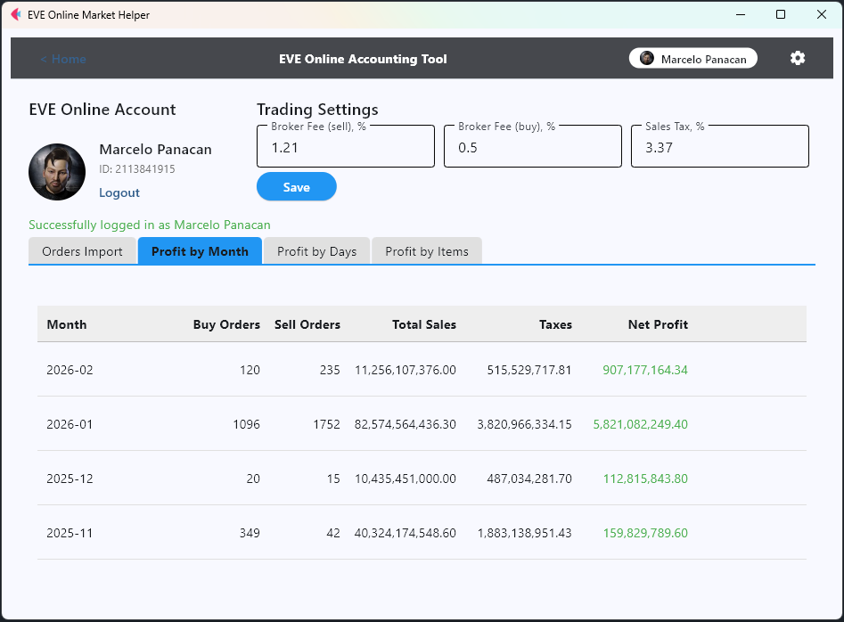
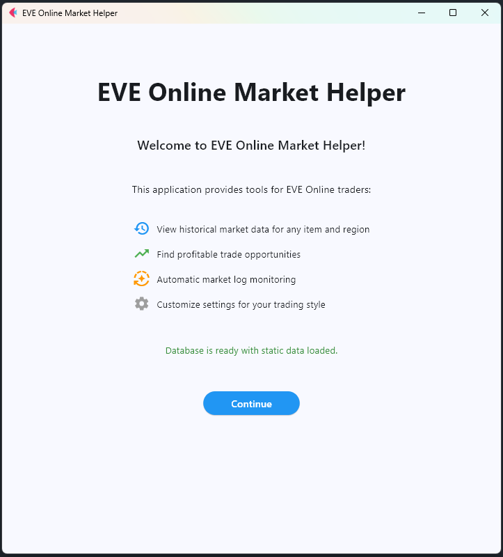
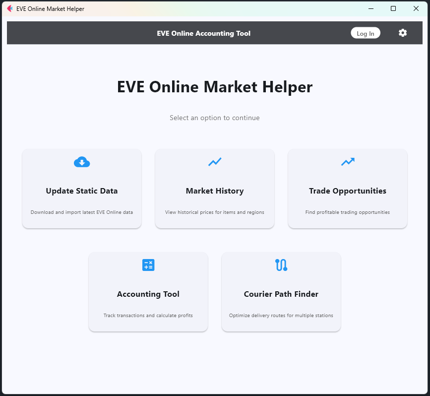
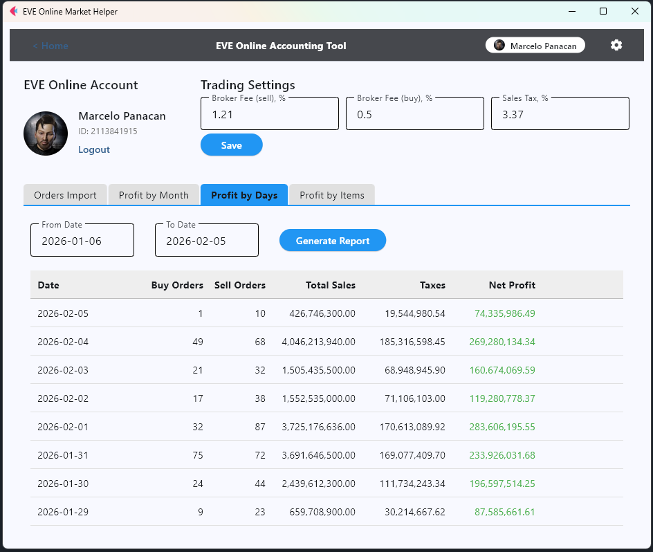
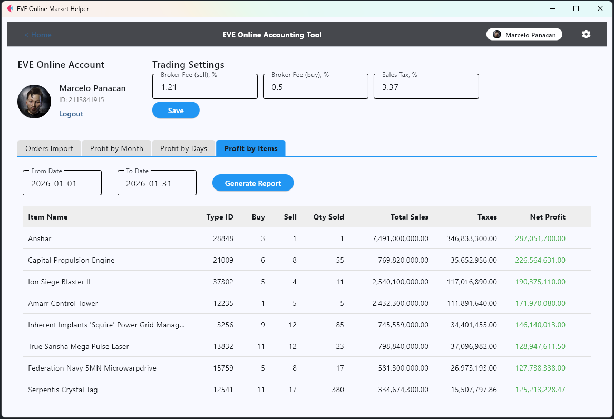
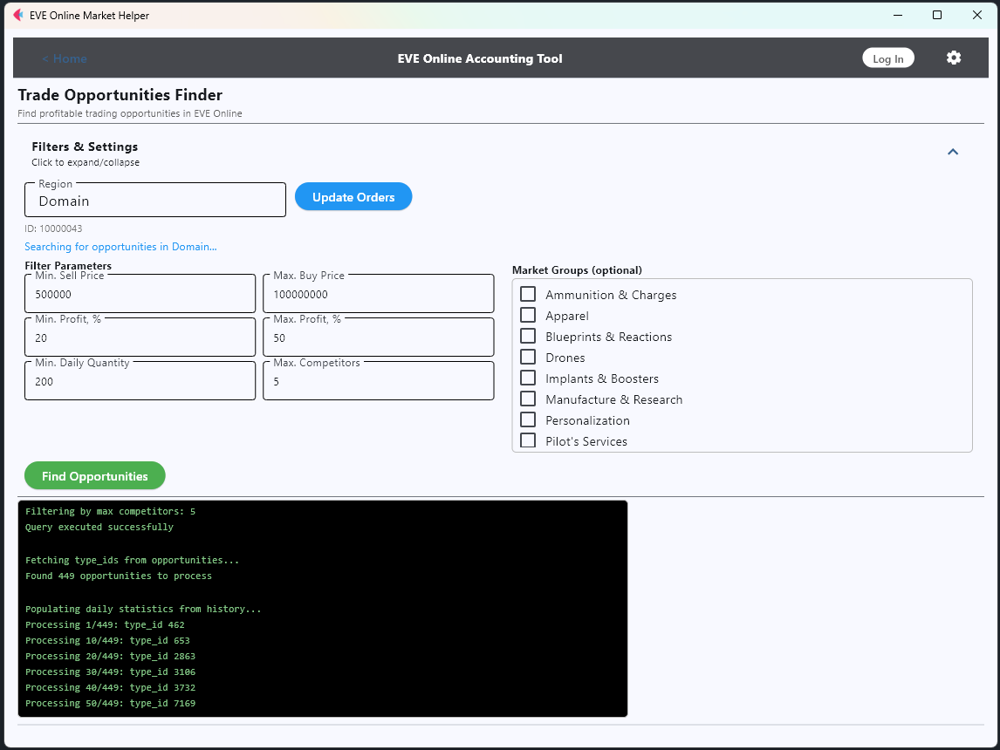
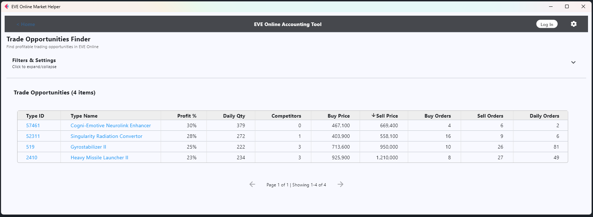
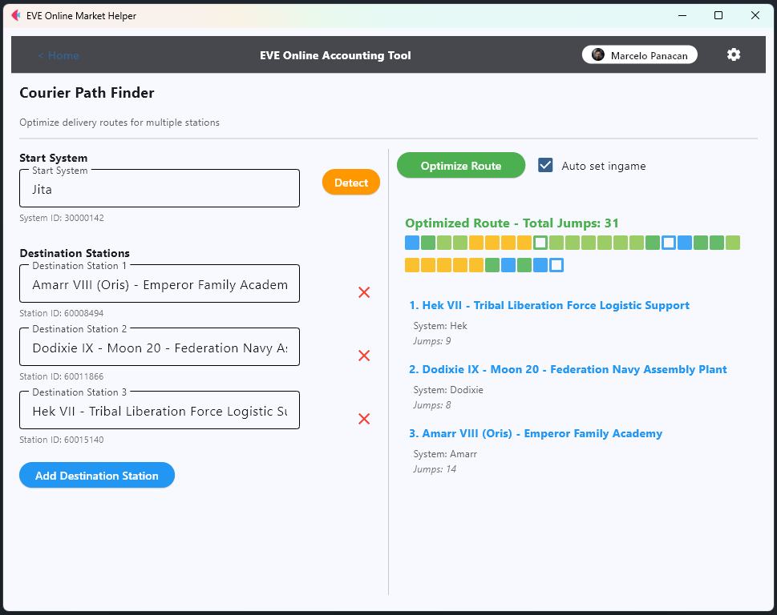

# EVE Online Market Analyzer

A comprehensive desktop application for EVE Online traders featuring market analysis, historical data viewing, and trade opportunity finding.



## Features

- ✅ **Menu-driven interface** with multiple tools for traders
- ✅ **Market History Viewer** - Real-time historical data from EVE Online ESI API
- ✅ **Trade Opportunities Finder** - Search for profitable trades (coming soon)
- ✅ **Integrated Settings** - Customize broker fees, taxes, and paths
- ✅ **Automatic Data Import** - Built-in static data management from Fuzzwork
- ✅ **Smart Autocomplete** - Fast region and item search
- ✅ **File Monitoring** - Automatic market log detection
- ✅ **Clean UI** built with Flet framework

## Prerequisites

- Python 3.8 or higher
- EVE Online client (for market logs monitoring)

## Installation and Setup

### 1. Clone Repository and Create Virtual Environment

**Windows (PowerShell):**
```powershell
git clone <repository-url>
cd eve-market-history
python -m venv .venv
.\.venv\Scripts\Activate.ps1
```

**Windows (CMD):**
```cmd
git clone <repository-url>
cd eve-market-history
python -m venv .venv
.venv\Scripts\activate.bat
```

**Linux/Mac:**
```bash
git clone <repository-url>
cd eve-market-history
python3 -m venv .venv
source .venv/bin/activate
```

### 2. Install Dependencies

```bash
pip install -r requirements.txt
```

### 3. Configure Application

Copy the example settings file and configure it:

```bash
# Linux/Mac
cp settings.py.example settings.py

# Windows
copy settings.py.example settings.py
```

Edit `settings.py` with your EVE market logs path:

```python
MARKETLOGS_DIR = r'C:\Users\YourName\Documents\EVE\logs\Marketlogs'
```

### 4. Run Application

```bash
python main.py
```

On first run, the application will:
- Create SQLite database file at `data/evetrader.db` if it doesn't exist
- Check if static data (regions and items) is present
- If data is missing, offer to import it with a button
- Show import progress in real-time

**Note:** The import process is now integrated into the application. You no longer need to run a separate import script!

## Usage

1. **Select Region**: Start typing a region name (e.g., "The Forge", "Jita") and select from the dropdown
2. **Select Item**: Start typing an item name (e.g., "PLEX", "Tritanium") and select from the dropdown
3. **Click "Get History"**: The application will fetch historical market data from the ESI API
4. **View Results**: Browse the table with dates, volumes, and price information

### Automatic Market Log Detection

If you configure `MARKETLOGS_DIR` correctly, the application will automatically:
- Monitor your EVE Online market logs directory
- Detect when you export market data in-game
- Auto-populate region and item fields
- Automatically fetch the history data

## Updating Static Data

EVE Online frequently adds new items, regions, and makes balance changes. To update your data:

1. Delete the existing data from database tables (or use database management tool)
2. Restart the application - it will detect empty tables and offer to re-import

**When to update:**
- After major EVE Online expansions
- When new items are added to the game
- If you notice missing items in the autocomplete
- At least once every few months for general maintenance

## Project Structure

```
eve_market_analyzer/
├── main.py                         # Main entry point
├── settings.py.example            # Example configuration file
├── settings.py                    # Your configuration (not in git)
├── requirements.txt               # Python dependencies
├── data/                          # SQLite database and CSV files (auto-created)
└── src/                           # Source code package
    ├── app.py                     # Main application class
    ├── handlers/                  # Event handlers
    │   ├── market_log_handler.py  # File system monitoring
    │   └── import_static_data.py  # Static data import functionality
    ├── ui/                        # UI components
    │   ├── init_screen.py         # Initialization/setup screen
    │   ├── autocomplete_field.py  # Autocomplete input field
    │   └── suggestion_item.py     # Suggestion list item
    └── database/                  # Database operations
        ├── validator.py           # Database validation
        └── data_loader.py         # Data loading utilities
```

## Screenshots

### Welcome Page

Initial page that checks database connection. If the database doesn't exist, it will be created automatically. If static data is missing, you'll be prompted to import it.



### Main Menu

The main page where you can select the section you need.



### Character & Profit Reports

Log in with your EVE character and set your Sales Tax and Broker Fee values for buying and selling (if you buy on a citadel and sell at an NPC station, these values may differ). These values are used when calculating profitability. On the same page you can view trade reports by months, days, and items. To load data from the game API, update your orders every time you open the application.






### Trade Opportunities Finder

Set your parameters and the application will fetch all orders for the selected region and find suitable trade positions. This may take a while — Jita has around 500,000 orders, which can take about 15 minutes to process.





### Courier Path Finder

To reduce Broker Fee you need to grind standings with a faction and corporation. One way to do this is courier missions. I used to take missions in bulk and then deliver goods. To plan an optimal route, the Courier Path Finder was developed — the application detects your character's current location, you specify the list of stations to visit, and it calculates the optimal path. This path is set in-game via the API. Currently the application does not account for security level and plots the shortest route. Be careful!



## Troubleshooting

### Database Errors

- The SQLite database is stored at `data/evetrader.db` and is created automatically on first run
- If the database is corrupted, delete `data/evetrader.db` and restart the application

### No Items/Regions in Dropdown

- Use "Update Static Data" from the main menu to populate the database
- Verify tables were created successfully

### Market Log Monitoring Not Working

- Verify `MARKETLOGS_DIR` path is correct
- Check that the directory exists
- Make sure you're exporting market data in EVE Online correctly

## Requirements

See `requirements.txt` for full list. Main dependencies:
- `flet>=0.80.0` - UI framework
- `requests` - API calls
- `watchdog` - File system monitoring
- `pandas` - Data processing

## License

MIT

## Contributing

Contributions are welcome! Please feel free to submit a Pull Request.

## Disclaimer

This application is not affiliated with or endorsed by CCP Games. EVE Online and all associated logos and designs are the intellectual property of CCP hf.
